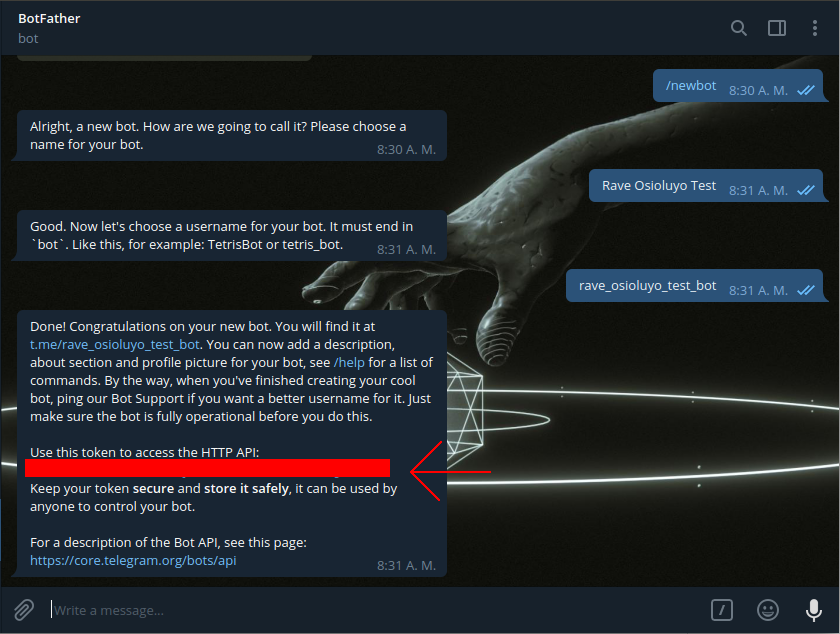

RaveGen: Telegram bot generator
===============================

Program for generate, create and deploy telegram bots using [python-telegram-bot](https://github.com/python-telegram-bot/python-telegram-bot) for connect with [Telegram Bot API](https://core.telegram.org/bots/api) and Heroku for deploy the bot.

# Installing


Download the package:

- Deb Package (Wait! Compiling...)
- Rpm Package (Wait! Compiling...)

Install the package:

- Deb package:

```shell
$ sudo dpkg -i ravegen-{version}.deb
```

- Rpm Package:

```shell
$ sudo dnf install ravegen-{version}.rpm
```
**OR** clone this repository and run `sudo make install`

# Create and deploy a bot in three steps!


## Step 1

Get the Token from [@BotFather](https://telegram.me/BotFather) 



## Step 2

Run the follow command and paste the Token:

```shell
$ ravegen init -m
```

## Step 3

Run this command and follow the indications:

```shell
$ ravegen deploy -d
```
## Eureka!

Now find your bot on Telegram and try to tell it something.

# Advanced usage

When you run `ravegen init -m`, you create an initial Rave project. The directories are the follow:
- **config:** This directory stores the configuration of Ravgen and requirements of the bot that you going to create.
- **module:** This directory stores the modules of the bot. Each module is a Handler function.
- **bot:** This directory is created when you run `ravegen create` or `revegen deploy`. It stores the bot.
- **log:** Here is the log file when logs and erros of Ravegen.

For more information about command run:

```shell
$ ravegen help
```


